### Hello world example

Using the web UI available on port `4400` of your remote machine, let' start our first simple job:

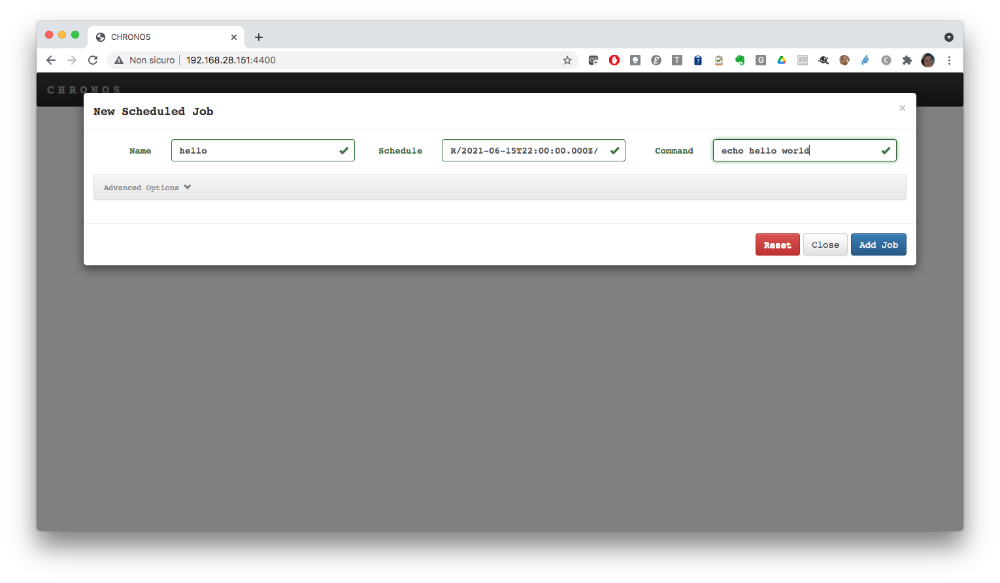

The job will run a `shell` command printing `hello world` on the standard output. It will execute every 30s. Indeed if you monitor the job execution, you will see that the job will be first queued, then it will run, then will be set to `idle` till the next run after 30s.

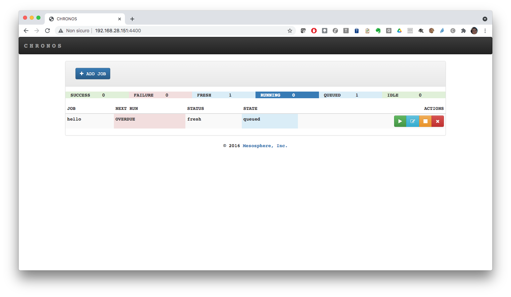

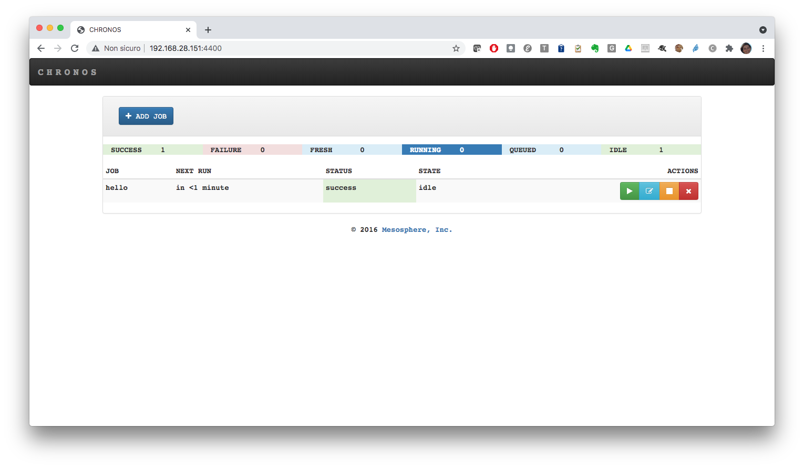

Look at the Mesos web UI to see the executed tasks:

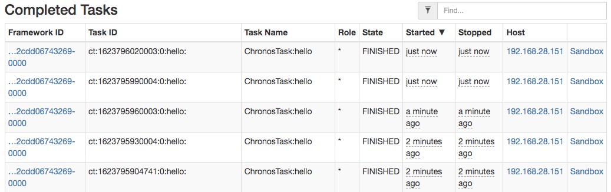


## Chronos REST APIs

The main API endpoint are the following:

| API Endpoint     | Description                          |
| :---------- | :----------------------------------- |
| `GET` /v1/scheduler/jobs                 |  This lists all jobs. The result is that JSON contains executor, invocationCount, and schedule/parents |
| `DELETE` /v1/scheduler/jobs              |  This deletes all jobs |
| `DELETE` /v1/scheduler/task/kill/jobName |  This deletes tasks for a given job |
| `DELETE` /v1/scheduler/job/jobName       | This deletes a particular job based on jobName |
|  `PUT` /v1/scheduler/job/jobName         | This manually starts a job |
|  `POST` /v1/scheduler/iso8601            | This adds a new job. The JSON passed should contain all the information about the job |
|  `POST` /v1/scheduler/dependency         | This adds a dependent job. It takes the same JSON format as a scheduled job. However, instead of the `schedule` field, it accepts a `parents` field. |
|  `GET` /v1/scheduler/graph/dot           | This returns the dependency graph in the form of a dot file |


## Executing a job in a Docker container

This time we will be using the REST API to submit the job. The endpoint to use is `/v1/scheduler/iso8601` and we will configure the job schedule so that it runs just one time (`R1//PT30s`):

Save the following json in a file with name `job.json`:

```bash
{
  "schedule": "R1//PT1M",
  "name": "dockerjob",
  "container": {
    "type": "DOCKER",
    "image": "ubuntu:latest"
  },
  "cpus": "0.1",
  "mem": "128",
  "command": "echo $(date)"
}

```

Then run the following command:

```bash
curl -i -H 'Content-Type: application/json' http://127.0.0.1:4400/v1/scheduler/iso8601 -d@job.json
```

If it works fine, you will get `204` response code:

```bash
HTTP/1.1 204 No Content
Date: Tue, 15 Jun 2021 22:42:49 GMT
Access-Control-Allow-Origin: *
Content-Type: application/json
Server: Jetty(9.3.z-SNAPSHOT)
```

Look at the web UI and see what happens. The job will run only once, then it will be disabled:

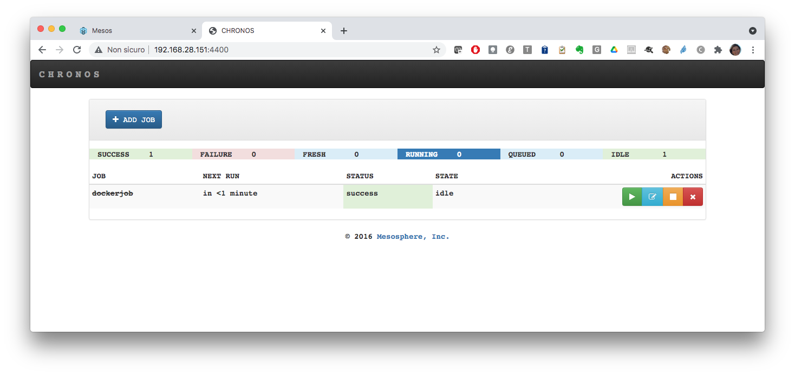

## Using URIs field to download resources

In the following example we will run a simple analysis job on an input dataset.

We will use a custom docker image derived from python:3 including some python libraries. Here is the dockerfile:

```bash
FROM python:3
RUN pip install scipy numpy matplotlib pandas sklearn
```

Push the image on docker hub and then use the `uris` field to download the python script [`dataset_analysis.py`](https://raw.githubusercontent.com/iotwins-demo/demo_m19/main/src/dataset_analysis.py) to be executed and the dataset [`iris.csv`](https://raw.githubusercontent.com/jbrownlee/Datasets/master/iris.csv):

```bash
{
  "schedule": "R1//PT1M",
  "name": "analysis-job",
  "container": {
    "type": "DOCKER",
    "image": "marica/demo-corso:latest"
  },
  "cpus": "1",
  "mem": "512",
  "retries": 3,
  "uris": [ "https://raw.githubusercontent.com/iotwins-demo/demo_m19/main/src/dataset_analysis.py", "https://raw.githubusercontent.com/jbrownlee/Datasets/master/iris.csv"],
  "command": "cd $MESOS_SANDBOX; python3 dataset_analysis.py iris.csv ./"
}
```

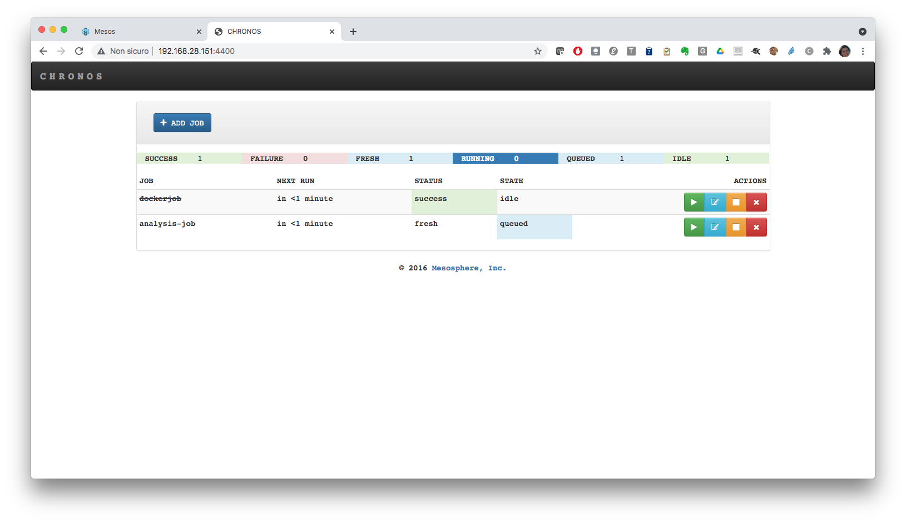

Go to the Mesos UI and access the job sandbox. 

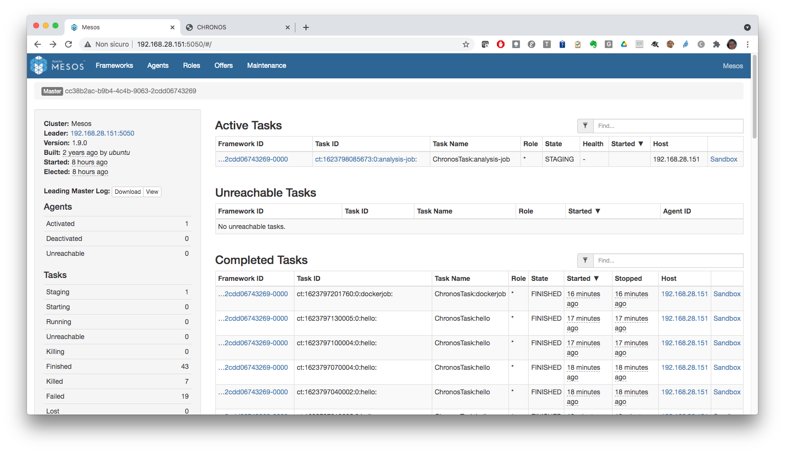

You will see the required files being downloaded:

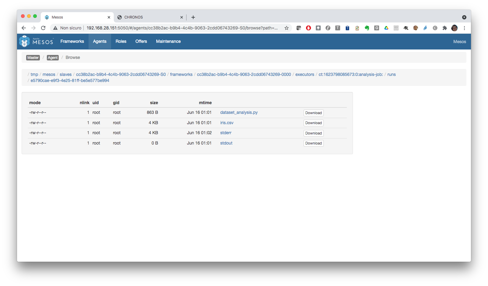

and after few moments the outputs generated by the job will appear:

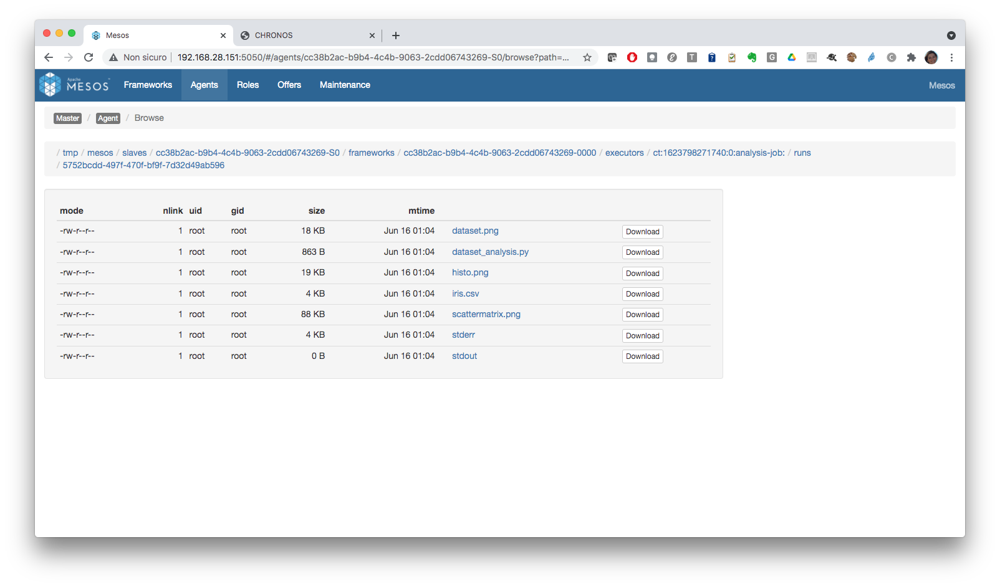

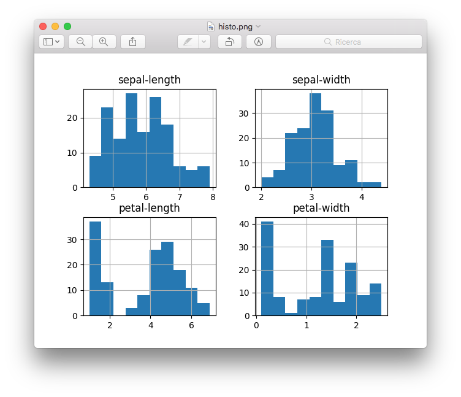

## Execute a job dependency chain

The web UI allows to add a dependent job clicking on `+ ADD JOB` -> `dependent`. As you can see you will be asked to choose a parent job:

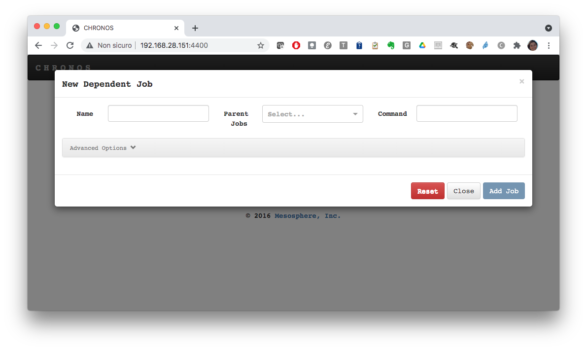

In the following we will be using the REST API:

- `POST` /v1/scheduler/iso8601 to add a scheduled job
- `POST` /v1/scheduler/dependency to add a dependent job

Let's create a first (parent) job that creates a file inside a local volume. 

Save the following json file as `schedjob.json`:

```bash
{
  "schedule": "R1/2031-06-17T07:00:00.000Z/PT10M",
  "name": "job1",
  "container": {
    "type": "DOCKER",
    "image": "ubuntu:latest",
    "network": "BRIDGE",
    "volumes": [
      {
        "containerPath": "/tmp/share",
        "hostPath": "/tmp",
        "mode": "RW"
      }
    ]
  },
  "cpus": "0.5",
  "mem": "512",
  "command": "echo Scritto da job1 > /tmp/share/job1; sleep 60;"
}
```

Look at the `schedule`: we are specifying the job start in 10y...just to control the execution start...

Run the following command to submit the job:

```bash
curl -X POST -H 'Content-Type: application/json' http://localhost:4400/v1/scheduler/iso8601 -d@schedjob.json
```
 
You will see `job1` in the list of jobs and it will not start as it scheduled in 10y

Now let's create the dependent job (`job2`) that will read the file from the same local volume and will add some content. Finally, the job will copy the file in its sandbox.

Save the following snippet as `depjob.json`:

```bash
{
  "name": "job2",
  "container": {
    "type": "DOCKER",
    "image": "ubuntu:latest",
    "network": "BRIDGE",
    "volumes": [
      {
        "containerPath": "/tmp/share",
        "hostPath": "/tmp",
        "mode": "RW"
      }
    ]
  },
  "parents": [
    "job1"
  ],
  "cpus": "0.5",
  "mem": "512",
  "command": "echo Scritto da job2 >> /tmp/share/job1; cp /tmp/share/job1 $MESOS_SANDBOX"
}
```

Launch the following command to add the dependent job:

```bash
curl -X POST -H 'Content-Type: application/json' http://localhost:4400/v1/scheduler/dependency -d@depjob.json
```

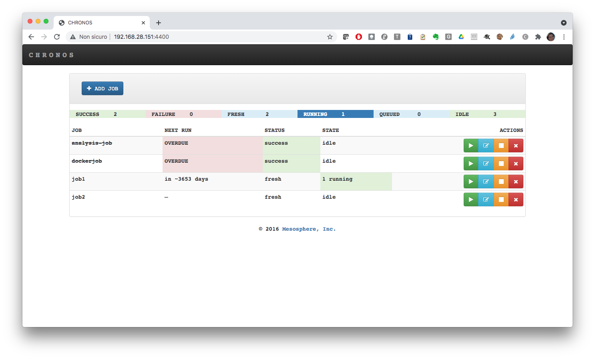

Now let's force `job1` to start. You can use the web UI or you can make a `PUT` request on /v1/scheduler/job/<job name>:

```bash
curl -X PUT http://localhost:4400/v1/scheduler/job/job1
```

The job will start and the dependent job will run only when the parent is completed.

Look at the Mesos UI and monitor the execution of the two tasks.

Then enter the job2 sandbox: you will find the file `job1` with the two lines written by the two jobs:

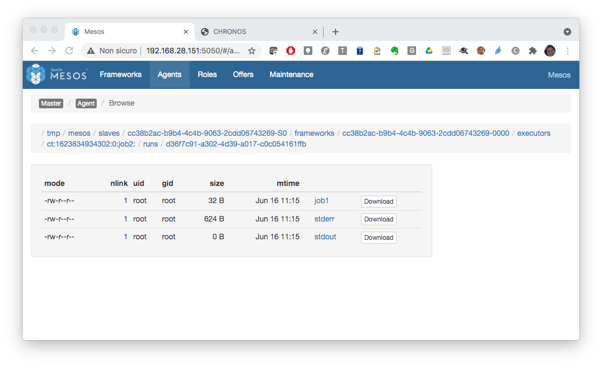

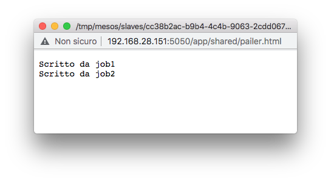


