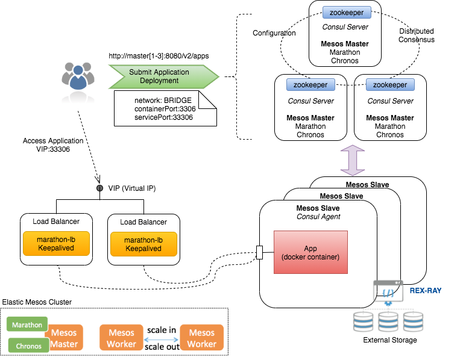
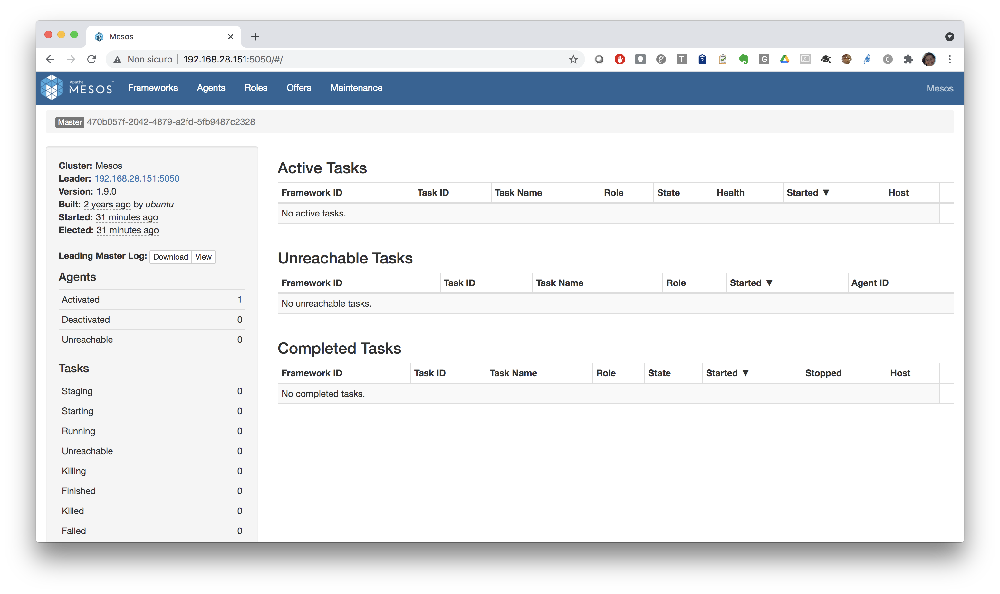
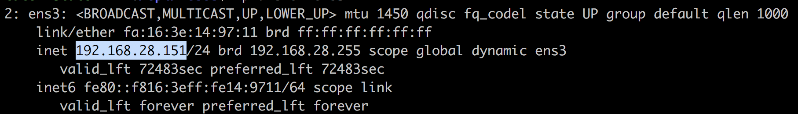
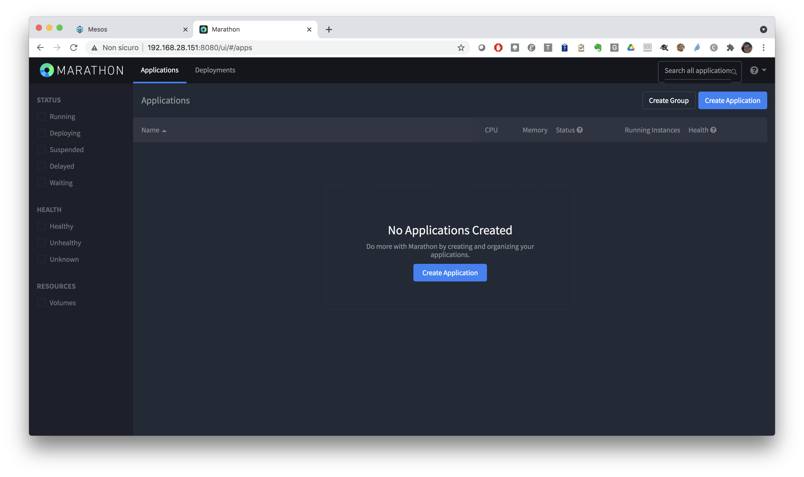
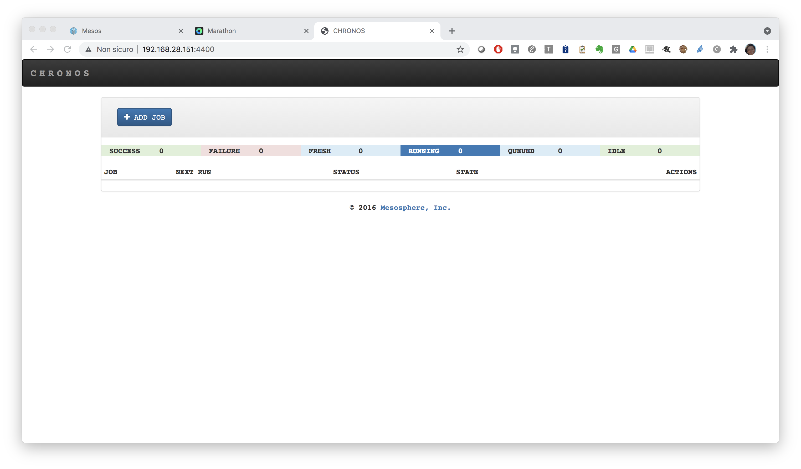

## Description of the mini-cluster

A typical production installation of a Mesos cluster is shown in the following diagram:

 

For this tutorial we will be using an *all-in-one* installation of Mesos/Marathon/Chronos.

This is the docker compose file used to setup the mini-cluster: 

```yaml
version: '3.7'

services:
  zookeeper:
    image: indigodatacloud/zookeeper
    expose:
      - 2181
    environment:
      - MYID=1
      - SERVERS=localhost
    volumes:
      - ./var/log/zookeeper:/var/log/zookeeper
      - ./var/lib/zookeeper:/var/lib/zookeeper
  mesosmaster:
    image: marica/mesos-master:1.11.0
    ports:
      - 5050:5050
    environment:
      - MESOS_HOSTNAME=192.168.28.196
      - MESOS_CLUSTER=Mesos
      - MESOS_ZK=zk://zookeeper:2181/mesos
      - MESOS_LOG_DIR=/var/log/mesos
      - MESOS_QUORUM=1
      - MESOS_WORK_DIR=/var/lib/mesos
      - MESOS_OFFER_TIMEOUT=30secs
    volumes:
      - ./var/log/mesos:/var/log/mesos
      - ./var/lib/mesos:/var/lib/mesos
    depends_on:
      - zookeeper
  mesosslave:
    image: marica/mesos-agent:1.11.0
    ports:
      - 5051:5051
    pid: host
    privileged: true
    environment:
      MESOS_MASTER: zk://zookeeper:2181/mesos
      MESOS_CONTAINERIZERS: docker,mesos
      MESOS_PORT: 5051
      MESOS_RESOURCES: ports(*):[11000-11999]
      MESOS_WORK_DIR: /tmp/mesos
      MESOS_HOSTNAME: 192.168.28.196
    volumes:
      - /sys/fs/cgroup:/sys/fs/cgroup
      - /var/run/docker.sock:/var/run/docker.sock
      - /tmp/mesos:/tmp/mesos
      - ./var/log/mesos:/var/log/mesos
    depends_on:
      - zookeeper
      - mesosmaster
  chronos:
    image: indigodatacloud/chronos:3.0.2_gpu
    ports:
      - 4400:4400
    environment:
      - CHRONOS_HOSTNAME=192.168.28.196
      - CHRONOS_HTTP_PORT=4400
      - CHRONOS_MASTER=zk://zookeeper:2181/mesos
      - CHRONOS_ZK_HOSTS=zk://zookeeper:2181
      - CHRONOS_ZK_PATH=/chronos/state
      - CHRONOS_MESOS_FRAMEWORK_NAME=chronos
    depends_on:
      - zookeeper
      - mesosmaster

  marathon:
    image: marica/marathon:1.8.244
    ports:
      - 8080:8080
    environment:
      - MARATHON_HOSTNAME=192.168.28.196
      - MARATHON_HTTP_PORT=8080
      - MARATHON_MASTER=zk://zookeeper:2181/mesos
      - MARATHON_ZK=zk://zookeeper:2181/marathon
      - MARATHON_FRAMEWORK_NAME=marathon
    depends_on:
      - zookeeper
      - mesosmaster

  marathon_lb:
    image: mesosphere/marathon-lb:v1.14.1
    command: sse --marathon http://marathon:8080 --group external
    ports:
      - "10000-10100:10000-10100"
    environment:
      - PORTS=9090
    depends_on:
      - marathon
```

Start the cluster:

```bash
cd /opt/mesos
docker-compose up -d
```
Check that the services are up and running:

```bash
docker-compose ps
```

```bash
       Name                      Command               State                    Ports
-------------------------------------------------------------------------------------------------------
mesos_chronos_1       /entrypoint.sh                   Up      0.0.0.0:4400->4400/tcp,:::4400->4400/tcp
mesos_marathon_1      /entrypoint.sh marathon          Up      0.0.0.0:8080->8080/tcp,:::8080->8080/tcp
mesos_mesosmaster_1   /entrypoint.sh /usr/sbin/m ...   Up      0.0.0.0:5050->5050/tcp,:::5050->5050/tcp
mesos_mesosslave_1    /entrypoint.sh /usr/sbin/m ...   Up      0.0.0.0:5051->5051/tcp,:::5051->5051/tcp
mesos_zookeeper_1     /entrypoint.sh /usr/share/ ...   Up      2181/tcp
```
Use your browser to connect to Mesos on port `5050` of your machine:



!!! tip
    Use the following command to get the ip of your VM:
    ```bash
    ip a show ens3
    ```
    {: style="width:700px" }
    
Open a new tab of your browser and connect to Marathon on port `8080` of your machine:    



Finally in another tab connect to Chronos on port `4400` of your machine:




