## Using Marathon web UI

Now, let’s start using the Marathon GUI. Click on **Create Application**:

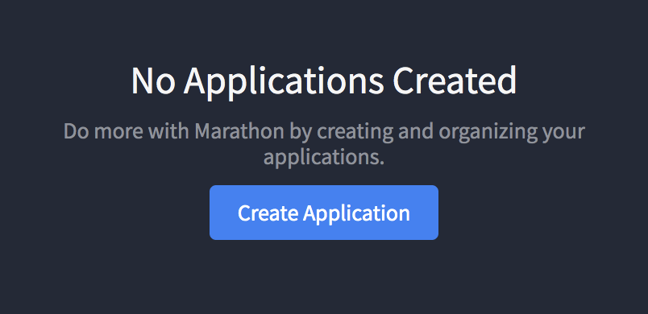{: style="width:400px" }

We are presented with a window in which we can name and configure an application to run in Marathon.
Let's try to deploy the application packaged in the [`nginxdemos/hello`](https://hub.docker.com/r/nginxdemos/hello/) docker image.

!!! note
    This image allows to run a NGINX webserver that serves a simple page containing its hostname, IP address and port as wells as the request URI and the local time of the webserver.

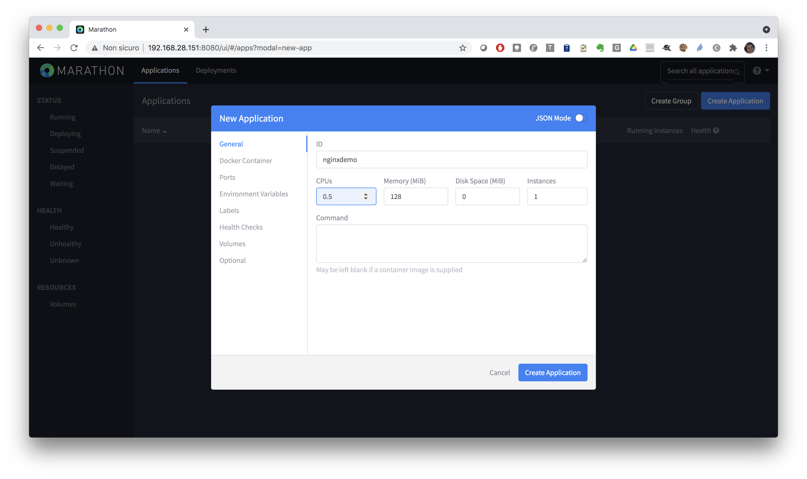

Change the Network field value to `Bridged`:

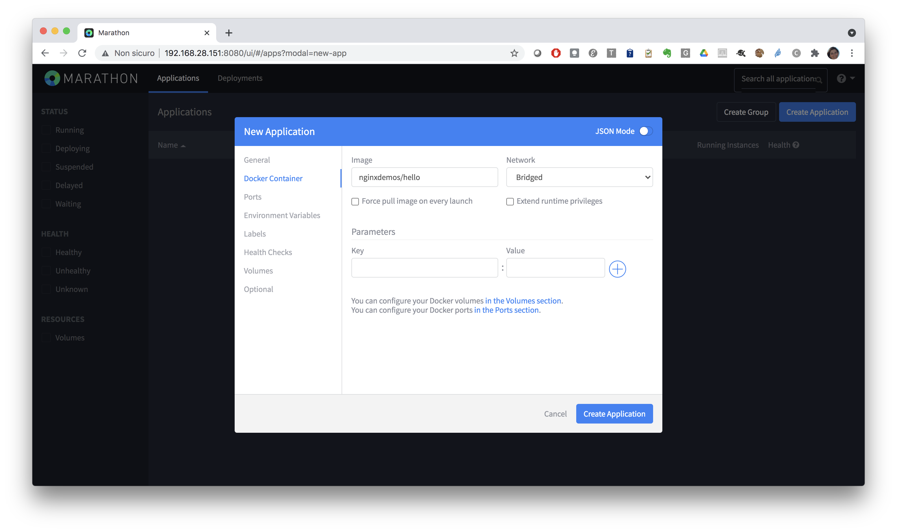

and specify the port `80` in the `Ports` tab in order to map the container port `80` (where nginx is listening inside the container) to a host port. 

Note that if you click on the `Json Mode` switch on the top right corner of the Application window you can see the `json` definition of your application:
 
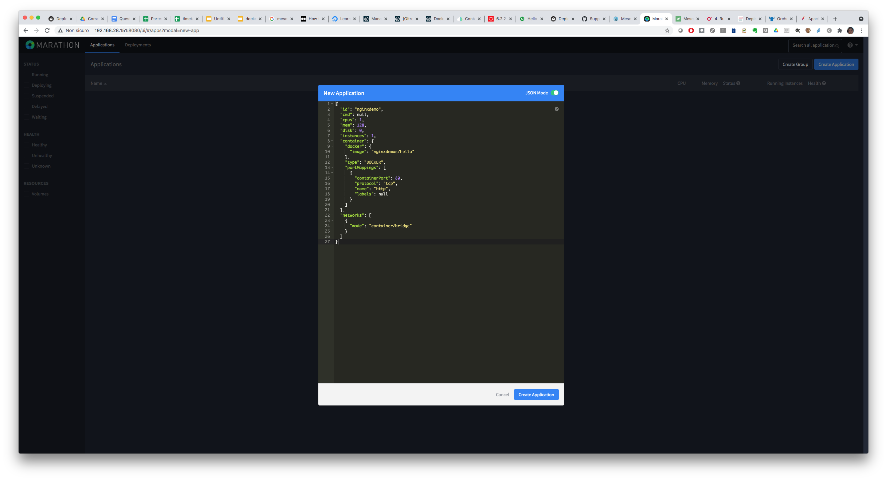

Then click on **Create Application**.

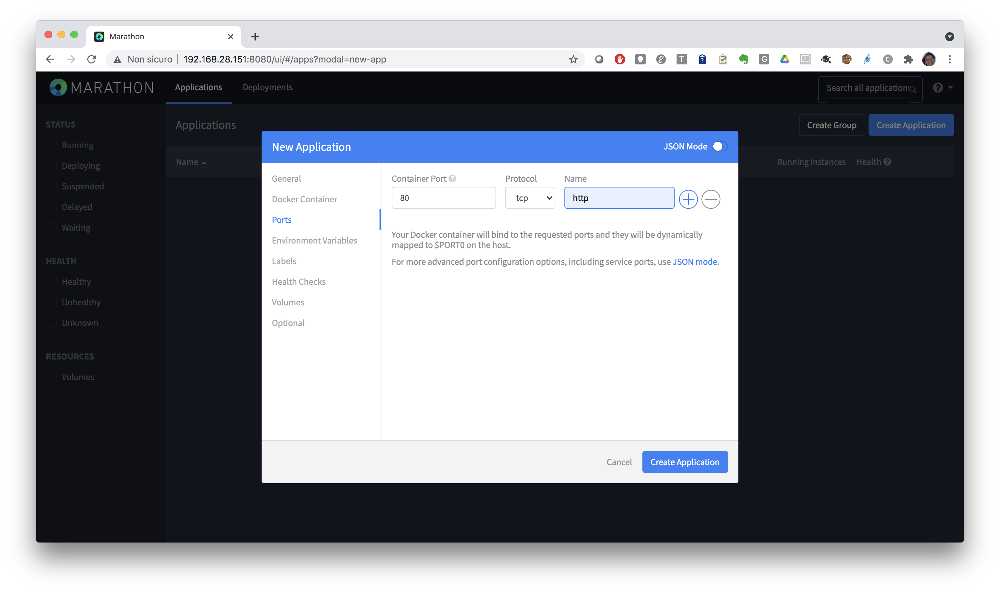

In a few moments you will see your application running.

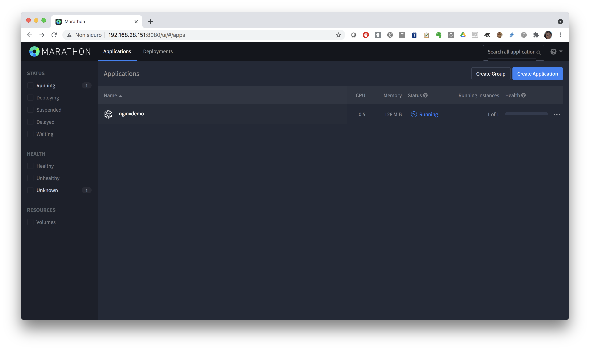

Click on the name of the application in order to access the application details and menu:

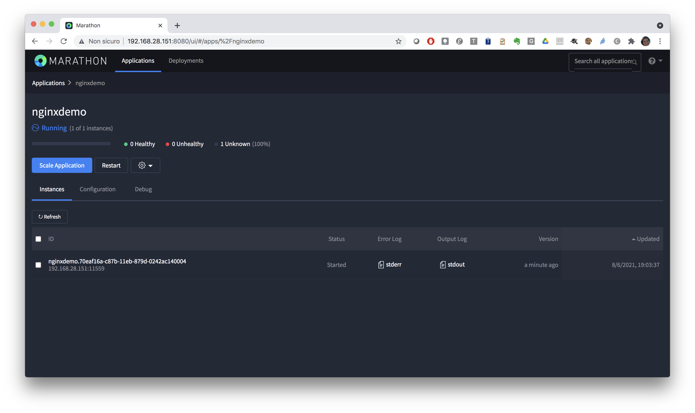

Under the `instances` tab you can see the `ID` of your application instance and the `IP:port`URL to access the deployed service. Click on it and you will access the demo web server:

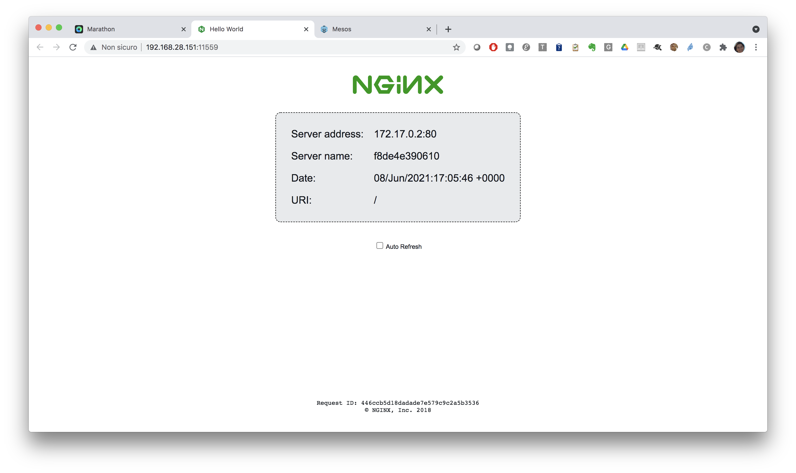

Now move to the Mesos web UI (port `5050`): you can see your running container under the `Active Tasks` window:

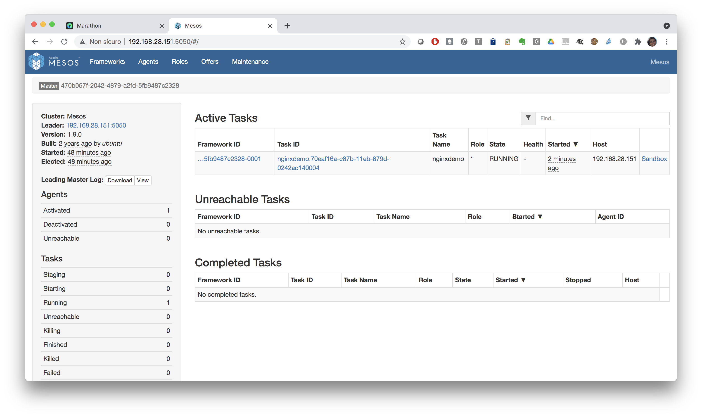

Clicking on the `Sandbox` link you will browse the container sandbox and read the `stdout` and `stderr` files:

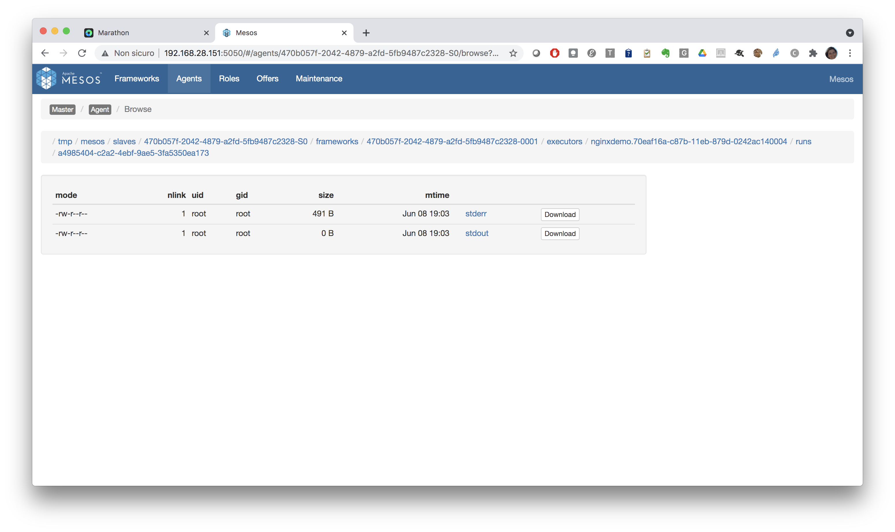

Finally you can destroy your application:

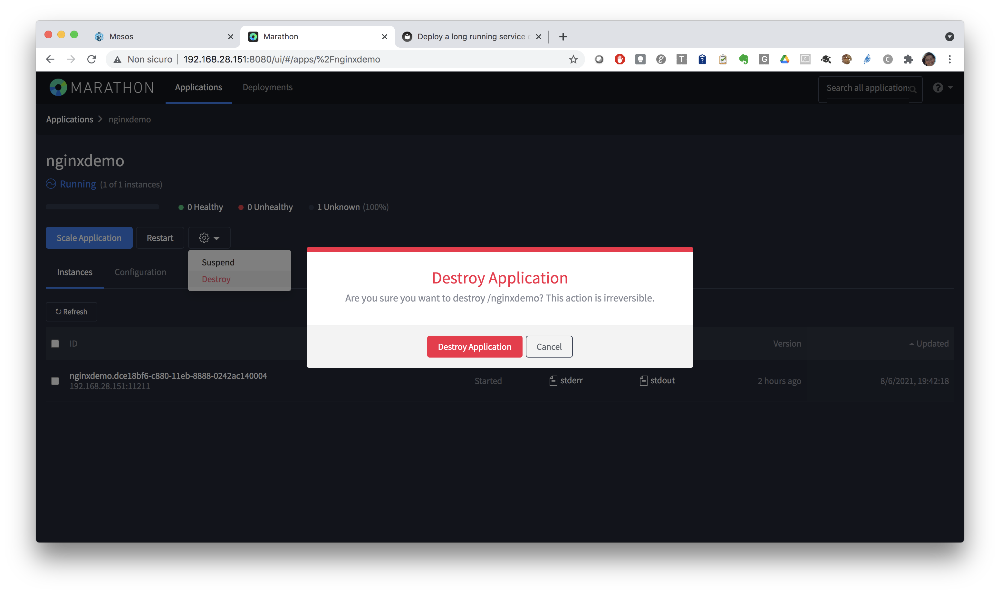


### Scaling and load-balancing

!!! note inline end "Reference"
    Take a look at the official docs: [https://mesosphere.github.io/marathon/docs/service-discovery-load-balancing.html](https://mesosphere.github.io/marathon/docs/service-discovery-load-balancing.html)
When your app is up and running, you need a way to send traffic to it, from other applications on the same cluster, and from external clients.
In your mini-cluster [`Marathon-lb`](https://github.com/mesosphere/marathon-lb) provides port-based service discovery using [`HAProxy`](http://www.haproxy.org/), a lightweight TCP/HTTP proxy.

Adding the label `HAPROXY_GROUP=external` to your application, you will expose your app on the Load Balancer (LB): services are exposed on their service port as defined in their Marathon definition.

Let's create again our application from `nginxdemos/hello` docker image, but this time we will add the label `HAPROXY_GROUP`:

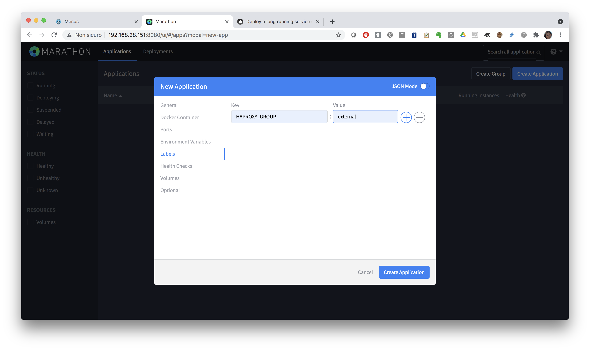

Looking at the app `Configuration` we can see the service port assigned to our service (in this case it was `10000`).
 
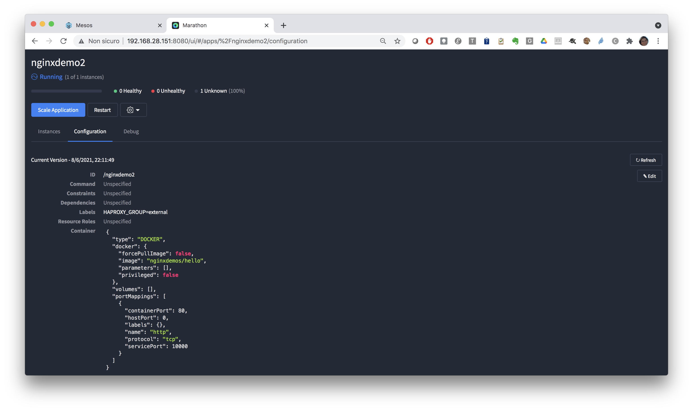

Connect to the service port on your host: you will see the web server main page.

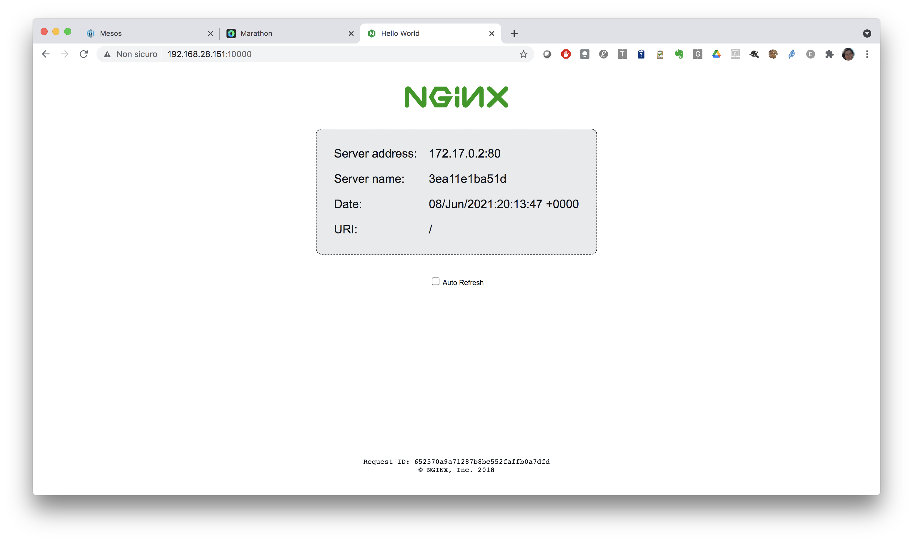


Now let's scale our application in order to have 2 instances of the web server:

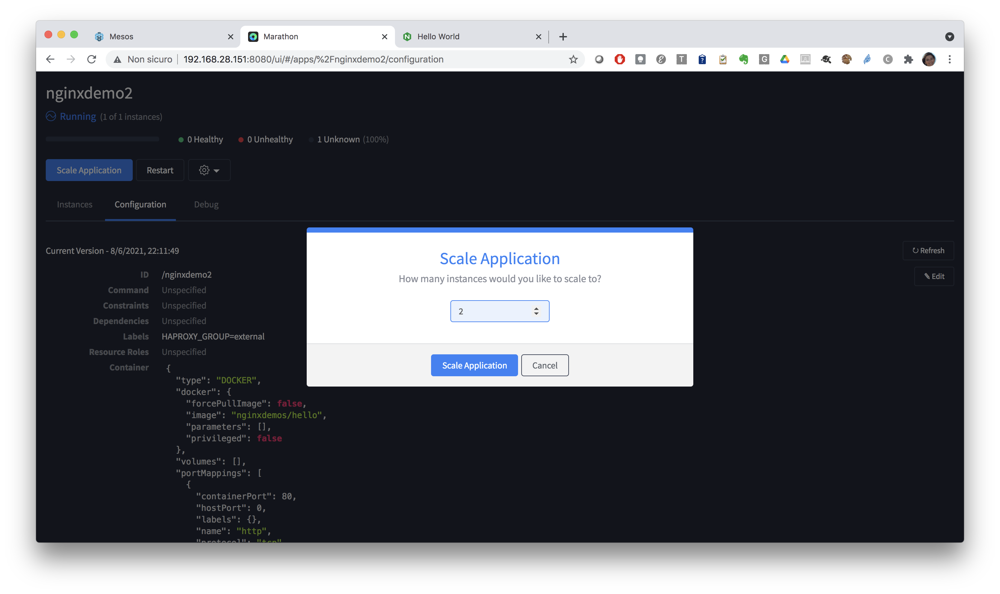

As you can see now we have two running docker containers, using two different host ports (11436 and 11849), but we can still use the service port `10000` managed by our `Marathon-lb`: client requests will be forwarded to each instance in turn.

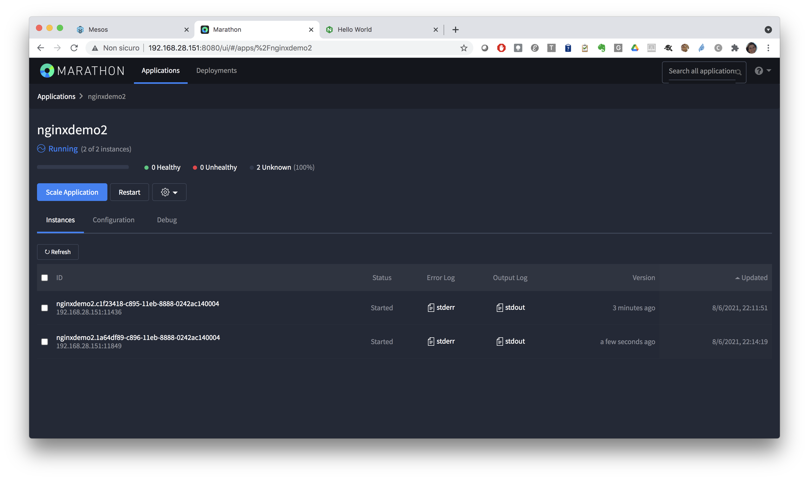

You can verify that using the following command:

```bash
curl --silent "http://192.168.28.151:10000"|grep 'name'
```
!!! warning
    Replace the IP `192.168.28.151`  with your VM IP and the port `10000` with the service port shown in the application `Configuration` tab. 

You will see the following behaviour showing that the requests are managed by the two containers in turn:

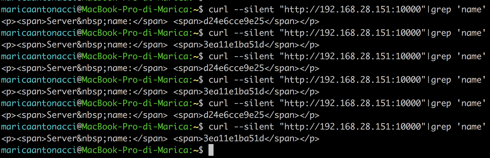{: style="width:800px;" }


## Marathon REST API

The following table reports the main API endpoints:

| API Endpoint     | Description                          |
| :---------- | :----------------------------------- |
| /v2/apps                | Query for all applications on a Marathon instance (`GET`) or create new applications (`POST`)  |
| /v2/apps/<app-id>       | Query for information about a specific app (`GET`), update the configuration of an app (`PUT`), or delete an app (`DELETE`) |
| /v2/groups              | Query for all application groups on a Marathon instance (`GET`) or create a new application group (`POST`) |
| /v2/groups/<group-id>   | Query for information about a specific application group (`GET`), update the configuration of an application group (`PUT`), or delete an application group (`DELETE`)|


## Application groups

Application groups are used to partition applications into disjoint sets for management.
Groups make it easy to manage logically related applications and allow you to perform actions on the entire group, such as scaling. 


Marathon takes dependencies into account while starting, stopping, upgrading and scaling.

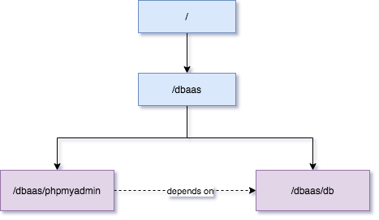

Here is the `json` definition of this application group:

!!! warning
    Replace the value of the env var `PMA_HOST` at line 52 with your VM IP.

```json linenums="1" hl_lines="52"
{
  "id": "/dbaas",
  "apps": [
    {
      "id": "/dbaas/db",
      "container": {
        "type": "DOCKER",
        "docker": {
          "image": "mariadb:10.3",
          "network": "BRIDGE",
          "portMappings": [
            {
              "containerPort": 3306,
              "servicePort": 10006,
              "protocol": "tcp"
            }
          ]
    }
      },
      "env": {
        "MYSQL_ROOT_PASSWORD": "s3cret",
        "MYSQL_USER": "phpma",
        "MYSQL_PASSWORD": "s3cret"
      },
      "labels": {
        "HAPROXY_GROUP": "external"
      },
      "instances": 1,
      "cpus": 0.5,
      "mem": 512
    },
    {
      "id": "/dbaas/phpmyadmin",
      "container": {
        "type": "DOCKER",
        "docker": {
          "image": "phpmyadmin/phpmyadmin",
          "network": "BRIDGE",
          "portMappings": [
            {
              "containerPort": 80,
              "servicePort": 10008,
              "protocol": "tcp"
            }
          ]
        }
      },
      "dependencies": [
        "/dbaas/db"
      ],
      "env": {
        "PMA_HOST": "192.168.28.151",
        "PMA_PORT": "10006"
      },
      "labels": {
        "HAPROXY_GROUP": "external"
      },
      "instances": 1,
      "cpus": 0.1,
      "mem": 256
    }
  ]
}
```

Look at the definition of the application group:

- in both applications we have set some **environment variables** (json tag `env`):

    * `MYSQL_ROOT_PASSWORD`, `MYSQL_USER`, `MYSQL_PASSWORD` are set for the first application `db`: these environment variables are required by the Official [`mariadb`](https://hub.docker.com/_/mariadb) docker image;
    * `PMA_HOST`, `PMA_PORT` are set for the second application `phpmyadmin`: these environment variables are required by the Official [`phpmyadmin`](https://hub.docker.com/r/phpmyadmin/phpmyadmin/) docker image.

- the `phpmyadmin` app depends on the `db` app: the dependency is defined at lines 48-50

    * this services communicates with the `db` using the service port (10006) defined at line 14.

Save the json above in a file, e.g. `dbaas.json`, and deploy it using the `/v2/groups` endpoint:

```bash
curl -H 'Content-Type: application/json' -X POST http://localhost:8080/v2/groups -d@dbaas.json
```

Through the Marathon web UI you can monitor your deployment:

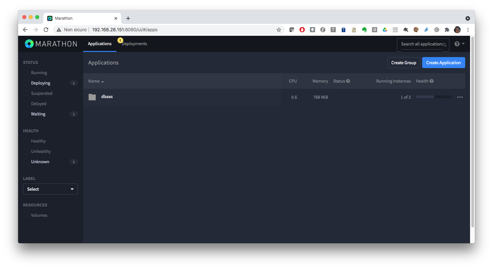

Click on the `dbaas` folder to see the applications of the group:

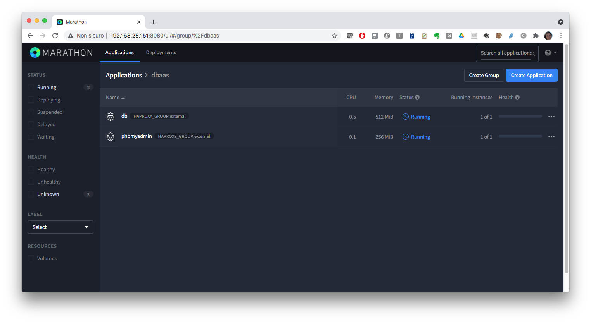

When they are running you will be able to access the phpmyadmin web tool on port `10008` of your VM:

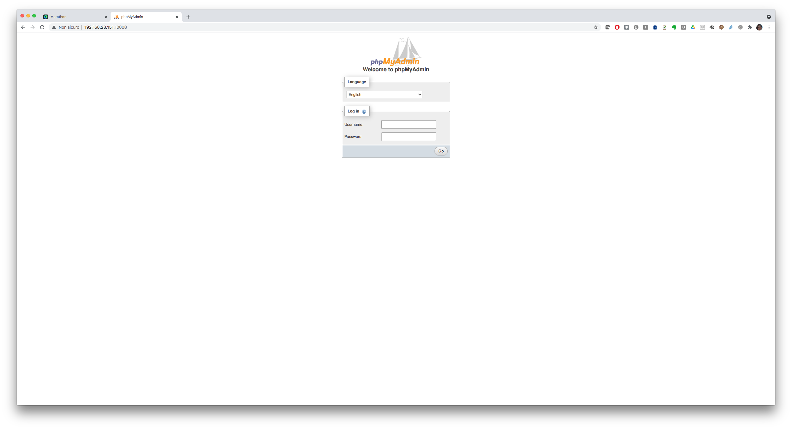

Use the `root` credentials to access the administrative panel of the DBMS (username root, password as set in the json at line ):

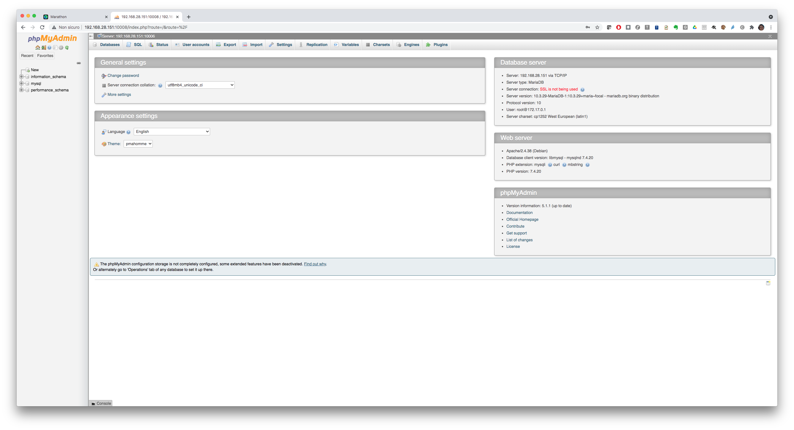

Let's create a new database `test`:

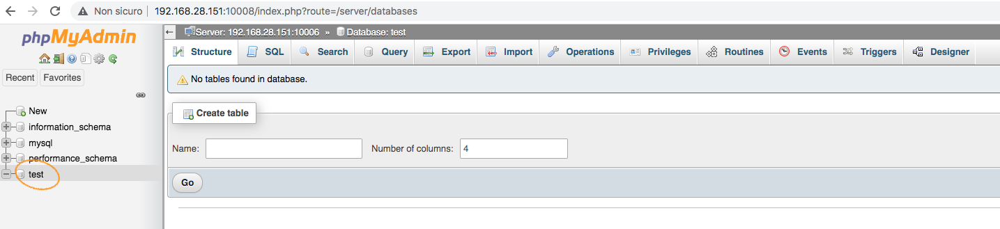

The new database has been stored in the `db` container...What happens if you restart the `db` app?

Click on button `Restart` in the `db` application menu:

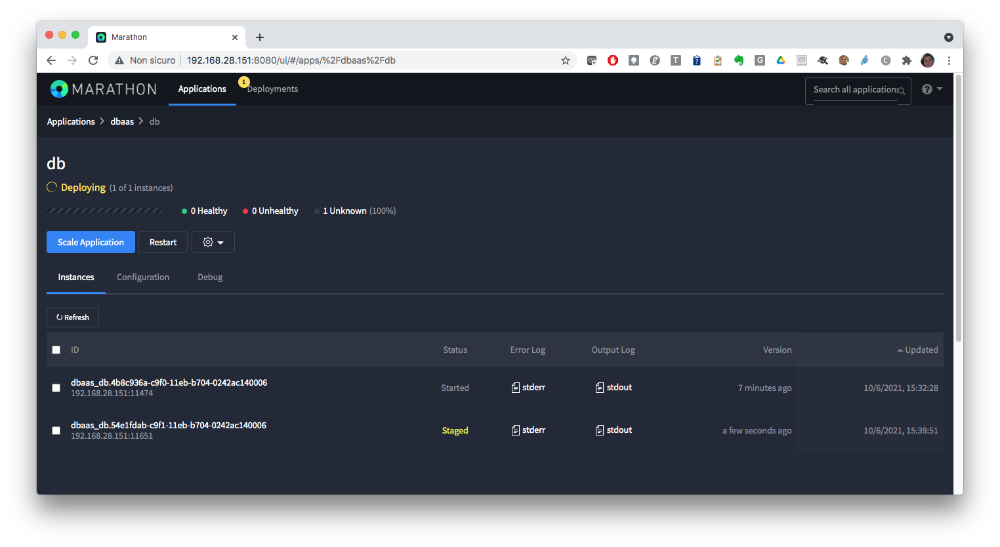

Marathon creates a new instance of our application, that means a new container; once the new container is up and running the old one is destroyed.

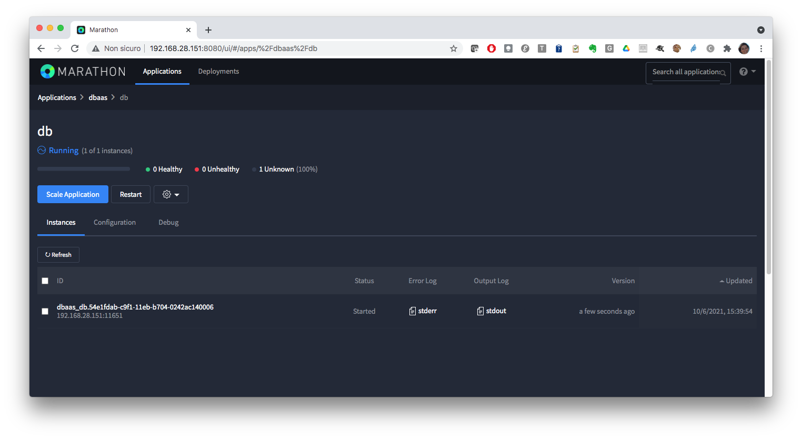

Since the database `test` was stored in the old container, we lose our data:

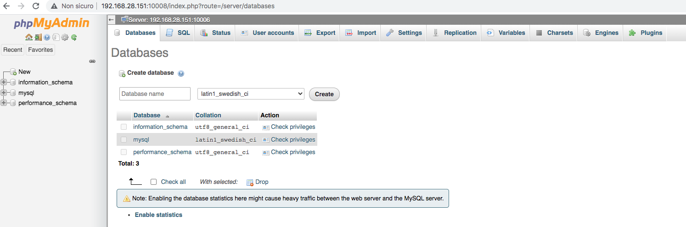 

### Providing persistent local storage


